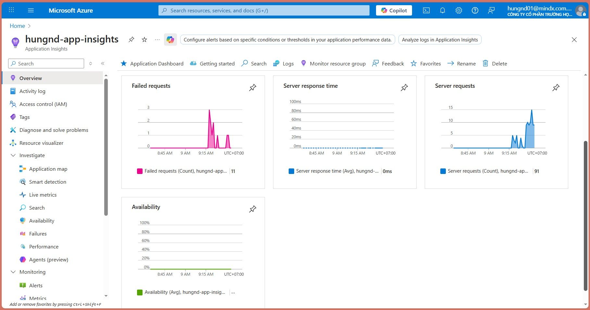
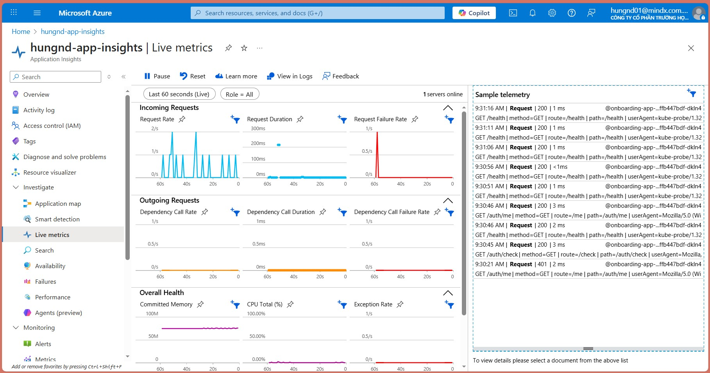
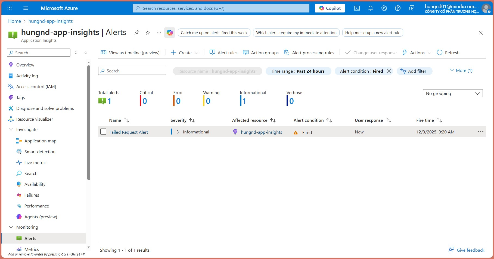

# 🔷 Azure Application Insights Setup (Backend)

Tài liệu này hướng dẫn cách thiết lập Azure Application Insights cho backend application.

## 📋 Mục lục

1. [Tạo Application Insights Resource trên Azure](#1-tạo-application-insights-resource-trên-azure)
2. [Lấy Connection String](#2-lấy-connection-string)
3. [Cấu hình Environment Variable](#3-cấu-hình-environment-variable)
4. [Cài đặt Package](#4-cài-đặt-package)
5. [Cấu hình trong Code](#5-cấu-hình-trong-code)
6. [Middleware Tracking Requests](#6-middleware-tracking-requests)
7. [Xem Live Metrics](#7-xem-live-metrics)
8. [Thiết lập Alerts](#8-thiết-lập-alerts)
9. [Kiểm tra và Xác minh](#9-kiểm-tra-và-xác-minh)
10. [Troubleshooting](#10-troubleshooting)

---

## 1. Tạo Application Insights Resource trên Azure

1. Đăng nhập vào [Azure Portal](https://portal.azure.com)
2. Tạo resource mới → Tìm "Application Insights"
3. Điền thông tin:
   - **Name**: Tên resource (ví dụ: `onboarding-app-insights`)
   - **Resource Group**: Chọn hoặc tạo resource group
   - **Region**: Chọn region phù hợp
4. Click **Review + Create** → **Create**

## 2. Lấy Connection String

Sau khi tạo xong Application Insights resource:

1. Vào resource vừa tạo
2. Vào mục **Overview** → Copy **Connection String**



Connection String có dạng:
```
InstrumentationKey=xxxxx-xxxx-xxxx-xxxx-xxxxxxxxxxxx;IngestionEndpoint=https://xxxxx.in.applicationinsights.azure.com/
```

## 3. Cấu hình Environment Variable

### Development (Local)

Cập nhật file `.env` trong `onboarding-app-be/`:

```bash
APPINSIGHTS_CONNECTION_STRING=InstrumentationKey=xxxxx-xxxx-xxxx-xxxx-xxxxxxxxxxxx;IngestionEndpoint=https://xxxxx.in.applicationinsights.azure.com/
```

**Lưu ý**: Trong file `env.example`, có typo là `APPINSIGHTS_CONNENTION_STRING` (thiếu chữ 'N'), nhưng trong code sử dụng `APPINSIGHTS_CONNECTION_STRING` (đúng chính tả).

### Production (Kubernetes)

Tạo Kubernetes Secret:

```bash
kubectl create secret generic appinsights-secret \
  --from-literal=connectionString="InstrumentationKey=xxxxx-xxxx-xxxx-xxxx-xxxxxxxxxxxx;IngestionEndpoint=https://xxxxx.in.applicationinsights.azure.com/"
```

Secret này đã được reference trong `onboarding-app-be/k8s/backend-deployment.yaml`:

```yaml
- name: APPINSIGHTS_CONNECTION_STRING
  valueFrom:
    secretKeyRef:
      name: appinsights-secret
      key: connectionString
```

## 4. Cài đặt Package

Package `applicationinsights` đã được cài đặt trong `package.json`:

```json
{
  "dependencies": {
    "applicationinsights": "^3.12.1"
  }
}
```

Nếu chưa có, cài đặt:

```bash
cd onboarding-app-be
npm install applicationinsights
```

## 5. Cấu hình trong Code

App Insights đã được cấu hình trong `onboarding-app-be/src/index.ts`:

```typescript
import appInsights from 'applicationinsights';

if (process.env.APPINSIGHTS_CONNECTION_STRING) {
  appInsights.setup(process.env.APPINSIGHTS_CONNECTION_STRING)
    .setSendLiveMetrics(true)           // Bật Live Metrics
    .setAutoCollectRequests(false)      // Tắt auto-collect, dùng middleware thủ công
    .setAutoCollectPerformance(true, true)
    .setAutoCollectDependencies(true)
    .setAutoCollectExceptions(true)
    .start();

  console.log("App Insights initialized");
}
```

## 6. Middleware Tracking Requests

Middleware tự động track tất cả HTTP requests với thông tin:
- Request method và URL
- Response status code
- Duration
- User agent

```typescript
if (process.env.APPINSIGHTS_CONNECTION_STRING) {
  app.use((req, res, next) => {
    const start = Date.now();
    const client = appInsights.defaultClient;

    res.on("finish", () => {
      if (client) {
        const duration = Date.now() - start;
        client.trackRequest({
          name: `${req.method} ${req.originalUrl}`,
          url: req.originalUrl,
          duration: duration,
          resultCode: res.statusCode.toString(),
          success: res.statusCode < 400,
          properties: {
            method: req.method,
            route: req.route?.path || req.originalUrl,
            path: req.originalUrl,
            userAgent: req.get('user-agent') || 'unknown',
          }
        });
      }
    });

    next();
  });
}
```

## 7. Xem Live Metrics

1. Vào Azure Portal → Application Insights resource
2. Vào mục **Live Metrics**
3. Bạn sẽ thấy real-time metrics của ứng dụng



## 8. Thiết lập Alerts

1. Vào Application Insights resource → **Alerts**
2. Click **Create** → **Alert rule**
3. Cấu hình:
   - **Signal**: Chọn metric (ví dụ: Failed requests, Response time)
   - **Condition**: Đặt ngưỡng cảnh báo
   - **Action group**: Tạo action group để nhận thông báo (email, SMS, etc.)



## 9. Kiểm tra và Xác minh

### Kiểm tra Logs

```bash
# Local
# Xem console log: "App Insights initialized"

# Kubernetes
kubectl logs -f deployment/onboarding-app-be
```

### Kiểm tra Live Metrics

1. Vào Azure Portal → Application Insights → Live Metrics
2. Thực hiện một số requests đến backend
3. Xem metrics xuất hiện trong real-time

### Kiểm tra Requests

1. Vào Application Insights → **Logs**
2. Chạy query:
   ```kusto
   requests
   | order by timestamp desc
   | take 10
   ```

## 10. Troubleshooting

### App Insights không hoạt động

1. **Kiểm tra Connection String**:
   - Đảm bảo biến môi trường `APPINSIGHTS_CONNECTION_STRING` được set đúng
   - Kiểm tra không có typo (phải là `CONNECTION`, không phải `CONNENTION`)

2. **Kiểm tra Network**:
   - Đảm bảo server có thể kết nối đến Azure endpoints
   - Kiểm tra firewall rules

3. **Kiểm tra Logs**:
   ```bash
   kubectl logs deployment/onboarding-app-be | grep -i "insights"
   ```

---

## 📚 Tài liệu tham khảo

- [Azure Application Insights Documentation](https://docs.microsoft.com/en-us/azure/azure-monitor/app/app-insights-overview)
- [Application Insights Node.js SDK](https://github.com/microsoft/ApplicationInsights-node.js)

