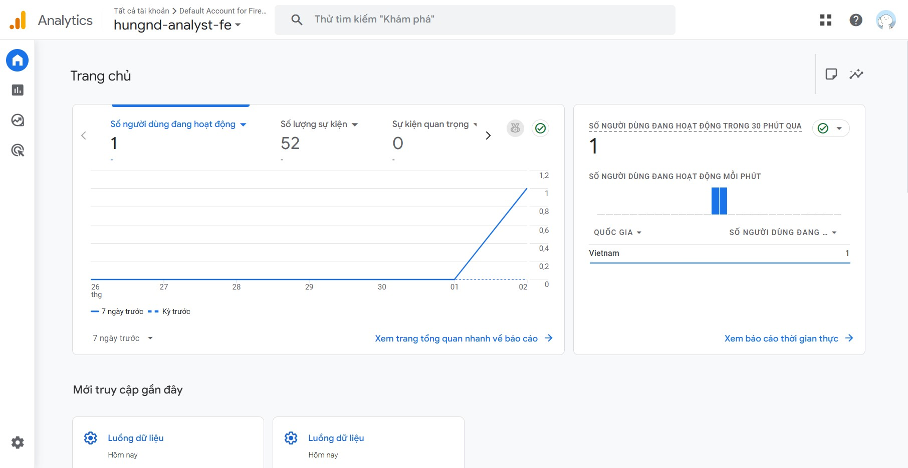

# 🔷 Google Analytics 4 Setup (Frontend)

Tài liệu này hướng dẫn cách thiết lập Google Analytics 4 (GA4) cho frontend application.

## 📋 Mục lục

1. [Tạo Google Analytics 4 Property](#1-tạo-google-analytics-4-property)
2. [Lấy Measurement ID](#2-lấy-measurement-id)
3. [Cấu hình Environment Variable](#3-cấu-hình-environment-variable)
4. [Cài đặt Package](#4-cài-đặt-package)
5. [Cấu hình trong Code](#5-cấu-hình-trong-code)
6. [Track Custom Events](#6-track-custom-events)
7. [Xem Dữ liệu trong Google Analytics](#7-xem-dữ-liệu-trong-google-analytics)
8. [Kiểm tra và Xác minh](#8-kiểm-tra-và-xác-minh)
9. [Troubleshooting](#9-troubleshooting)

---

## 1. Tạo Google Analytics 4 Property

1. Đăng nhập vào [Google Analytics](https://analytics.google.com/)
2. Click **Admin** (⚙️) ở góc dưới bên trái
3. Tạo **Property** mới:
   - Chọn **Create Property**
   - Điền tên property (ví dụ: `Onboarding App`)
   - Chọn timezone và currency
4. Tạo **Data Stream**:
   - Chọn **Web**
   - Điền Website URL
   - Đặt tên stream (ví dụ: `Onboarding App Web`)

## 2. Lấy Measurement ID

Sau khi tạo Data Stream, bạn sẽ nhận được **Measurement ID** (có dạng `G-XXXXXXXXXX`).



## 3. Cấu hình Environment Variable

### Development (Local)

Cập nhật file `.env` trong `onboarding-app-fe/`:

```bash
REACT_APP_GA_TRACKING_ID=G-XXXXXXXXXX
```

**Lưu ý**: React sử dụng prefix `REACT_APP_` cho environment variables.

### Production (Docker/Kubernetes)

Thêm environment variable vào deployment:

```yaml
env:
- name: REACT_APP_GA_TRACKING_ID
  value: "G-XXXXXXXXXX"
```

Hoặc sử dụng ConfigMap/Secret:

```bash
# Tạo ConfigMap
kubectl create configmap ga-config \
  --from-literal=REACT_APP_GA_TRACKING_ID="G-XXXXXXXXXX"
```

## 4. Cài đặt Package

Package `react-ga4` đã được cài đặt trong `package.json`:

```json
{
  "dependencies": {
    "react-ga4": "^2.1.0"
  }
}
```

Nếu chưa có, cài đặt:

```bash
cd onboarding-app-fe
npm install react-ga4
```

## 5. Cấu hình trong Code

### File `src/utils/analystic.ts`

File này chứa các utility functions cho Google Analytics:

```typescript
import ReactGA from "react-ga4";

const GA_TRACKING_ID = process.env.REACT_APP_GA_TRACKING_ID || "";

export const initGA4 = (): void => {
  if (!GA_TRACKING_ID) {
    console.warn('Google Analytics tracking ID is not set (REACT_APP_GA_TRACKING_ID)');
    return;
  }
  ReactGA.initialize(GA_TRACKING_ID);
  console.log('Google Analytics initialized with ID:', GA_TRACKING_ID);
};

export const logPageViewGA4 = (page: string): void => {
  if (!GA_TRACKING_ID) return;
  ReactGA.send({ 
    hitType: "pageview", 
    page_path: page, 
    page_title: document.title 
  });
};

export const logEventGA4 = (category: string, action: string, label?: string): void => {
  if (!GA_TRACKING_ID) return;
  ReactGA.event({
    category,
    action,
    label: label || undefined,
  });
};
```

### File `src/App.tsx`

Google Analytics được khởi tạo và track page views tự động:

```typescript
import { initGA4, logPageViewGA4 } from './utils/analystic';

function App() {
  const location = useLocation();

  // Khởi tạo GA4 khi app chạy
  useEffect(() => {
    initGA4();
  }, []);

  // Track page view mỗi khi location thay đổi
  useEffect(() => {
    logPageViewGA4(location.pathname + location.search);
  }, [location]);

  // ... rest of component
}
```

## 6. Track Custom Events

Để track custom events (ví dụ: button clicks, form submissions), sử dụng function `logEventGA4`:

```typescript
import { logEventGA4 } from './utils/analystic';

// Ví dụ: Track button click
const handleButtonClick = () => {
  logEventGA4('Button', 'Click', 'Login Button');
  // ... rest of handler
};

// Ví dụ: Track form submission
const handleSubmit = () => {
  logEventGA4('Form', 'Submit', 'Contact Form');
  // ... rest of handler
};
```

## 7. Xem Dữ liệu trong Google Analytics

1. Đăng nhập vào [Google Analytics](https://analytics.google.com/)
2. Chọn property của bạn
3. Vào **Reports** để xem:
   - **Realtime**: Xem dữ liệu real-time
   - **Engagement** → **Pages and screens**: Xem page views
   - **Engagement** → **Events**: Xem custom events


## 8. Kiểm tra và Xác minh

### Kiểm tra Console

1. Mở browser DevTools (F12)
2. Xem Console: "Google Analytics initialized with ID: G-XXXXXXXXXX"

### Kiểm tra Network Tab

1. Mở DevTools → Network tab
2. Filter: "collect" hoặc "analytics"
3. Xem requests đến `google-analytics.com` hoặc `analytics.google.com`

### Kiểm tra Realtime Report

1. Vào Google Analytics → Realtime
2. Navigate trong app
3. Xem page views xuất hiện trong real-time

### Sử dụng Google Analytics Debugger

1. Cài extension [Google Analytics Debugger](https://chrome.google.com/webstore/detail/google-analytics-debugger/jnkmfdileelhofjcijamephohjechhna)
2. Bật extension và xem console logs chi tiết

## 9. Troubleshooting

### Google Analytics không hoạt động

1. **Kiểm tra Measurement ID**:
   - Đảm bảo biến môi trường `REACT_APP_GA_TRACKING_ID` được set
   - Đảm bảo có prefix `REACT_APP_`

2. **Kiểm tra Build**:
   - Environment variables chỉ được inject khi build
   - Cần rebuild app sau khi thay đổi env vars:
     ```bash
     npm run build
     ```

3. **Kiểm tra Ad Blockers**:
   - Một số ad blockers có thể chặn Google Analytics
   - Test với ad blocker tắt hoặc ở chế độ incognito

4. **Kiểm tra CORS**:
   - Đảm bảo không có CORS errors trong console

---

## 📚 Tài liệu tham khảo

- [Google Analytics 4 Documentation](https://developers.google.com/analytics/devguides/collection/ga4)
- [react-ga4 Documentation](https://github.com/codler/react-ga4)

